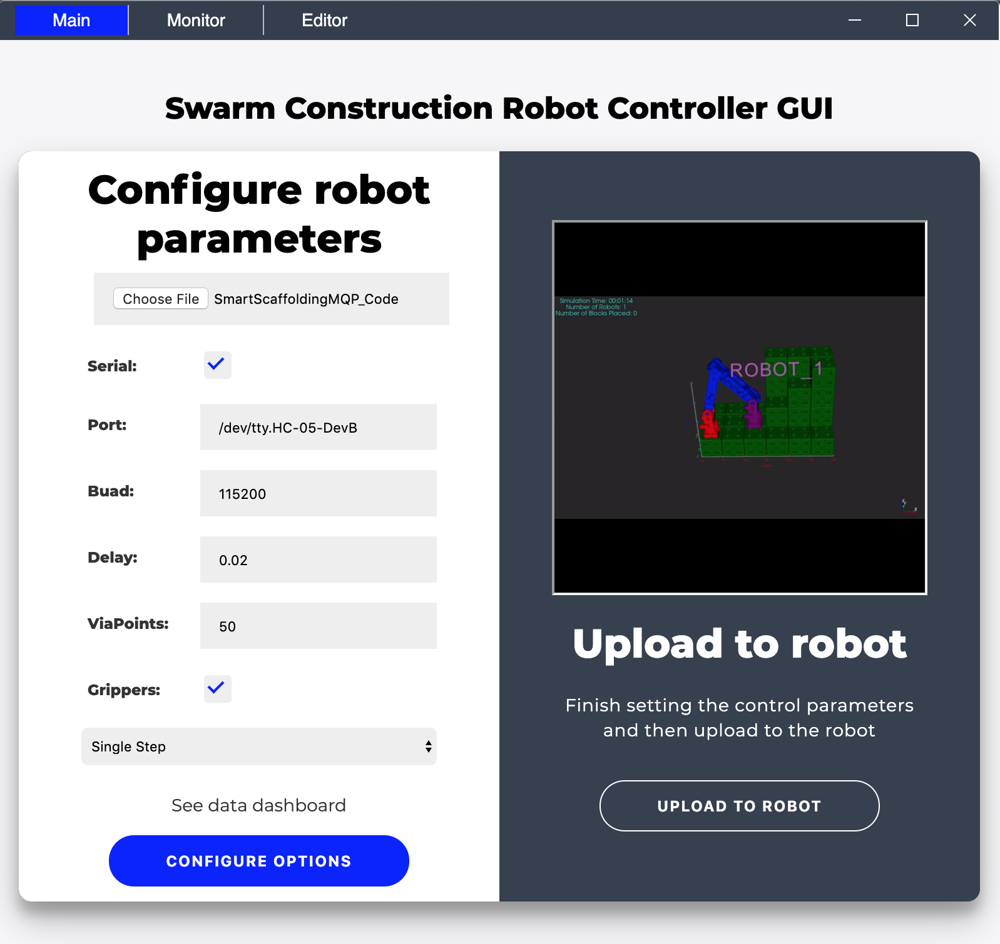
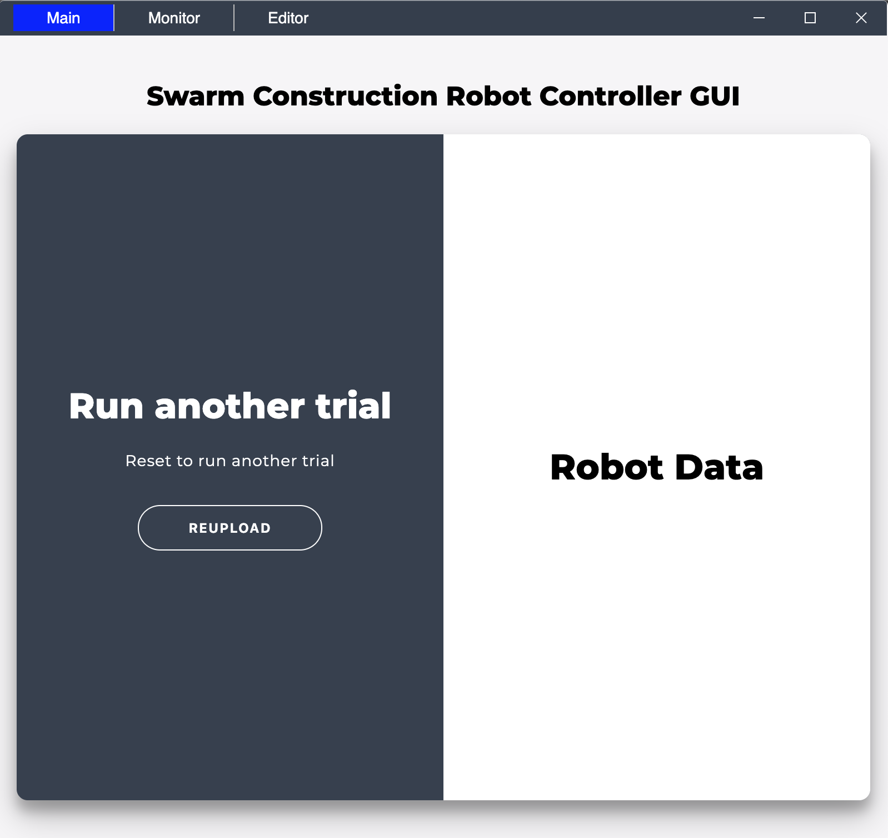
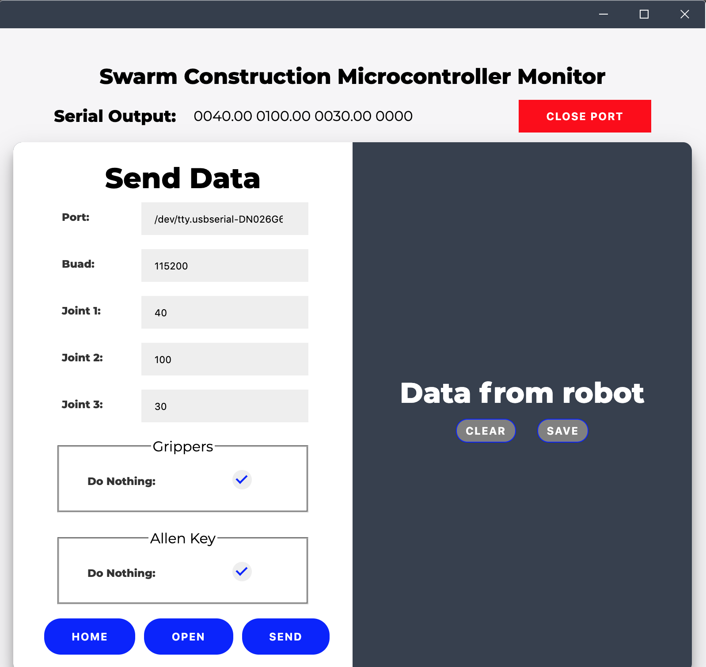
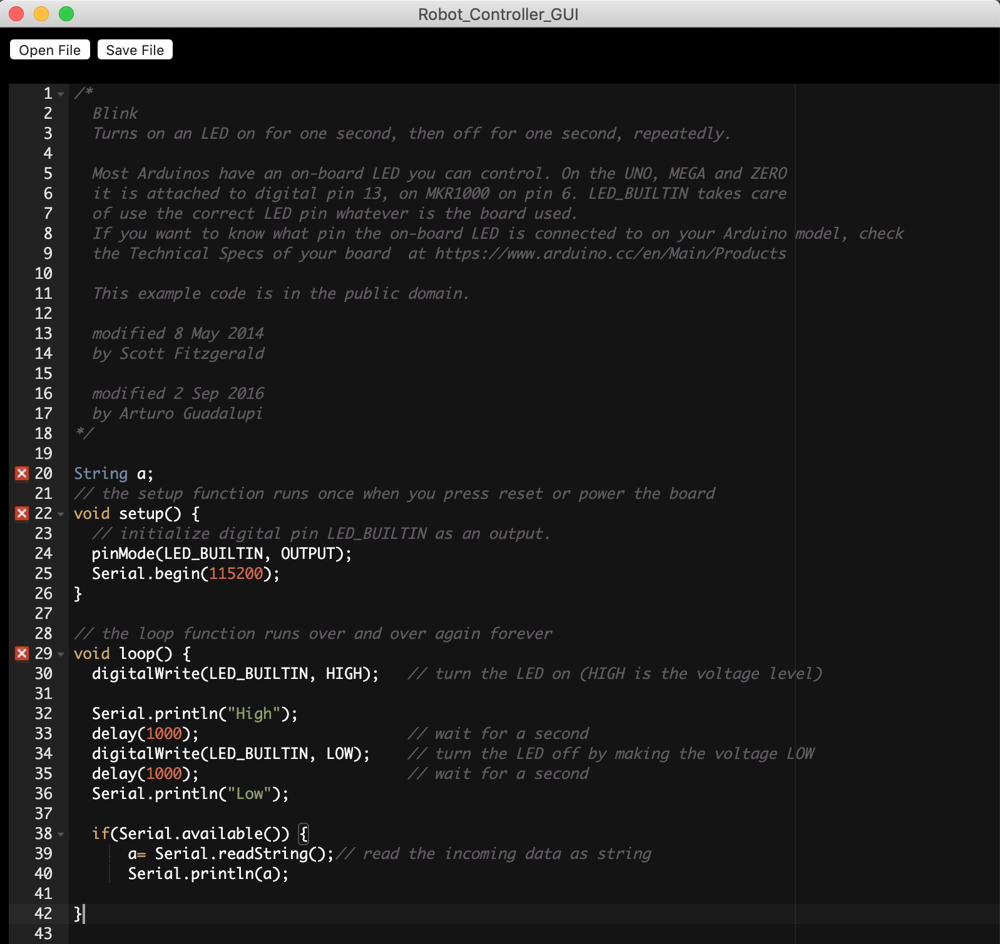

Robot Controller GUI
=====================

Repository for Swarm Construction Robot Controller GUI code. This is a graphical user interface that allows users to send both high level and low level communications easily. It can be used to replace the Arduino serial monitor. This code can be run as a desktop application so that dependencies do not need to be built. 

Getting Started
---------------

These instructions will get you a copy of the project up and running on
your local machine for development, user, and testing purposes.

Running the Desktop Application
~~~~~~~~~~~~~~~~~~~~~~~~~~~~~~~~~~~~~~~
All of the prebuilt desktop applications can be found in the "build" folder in the repository. Download the folder that corresponds to your personal machine. Note that OSX (Max) users should use the folder "Darwin". Within the folder, run (by double clicking on) the application file that is specific to your machine. For OSX users, this will be the .app folder, for Windows users, this will be the .exe file, etc.     

Running the Code Locally
~~~~~~~~~~~~~~~~~~~~~~~~~~~~~~~~~~~~~~~~

A step by step series of examples that tell you how to get a development
env running. After cloning the repository, run the following command to install all dependencies:

::

    npm install

Once all packages have been installed, run the following command to start the development environment:

::

    npm start

The application should now open, and you can interact with it the same as the desktop applications. 

Packaging the Code
~~~~~~~~~~~~~~~~~~~~~~~~~~~~~~~~~~~~~~~~

In order to package the code and create desktop applications that others can easily install, run the following command:

::

    npm run package

This will cause the electron-packager to generate all of the build files. 

**Note:** Running this command will overwrite all of the existing built applications (all files in the "build" folder). Make sure this is what you want to do before running. If you wish to change this or other flags, refer to the electron-packager documentation. 

Using the Application
----------------------
All options provide tooltips that can be displayed to provide more information. Make sure to hover over options in the application in order to learn more. 

Home Application
~~~~~~~~~~~~~~~~~~~~

The home application can be used to send high level commands (trajectories) to the robot. In order to interact with the high level code that is written in Python, you must first select the location of where the high level code `Swarm Construction <https://github.com/smart-scaffolding/swarm_construction>`__ is using the file selector. Follow the instructions of this README to install all dependencies and get the high level code running. 

**Note:** If the high level code is not installed correctly, the Home Application will not be able to successfully upload the code to the robot. 

Use the other options in the form to change various parameters when uploading to the robot, especially the port. If you have plugged in the robot and do not yet see your port, wait a few seconds, as it can sometimes take a few seconds before the list updates. If you still do not see it, enter in the port manually. Using the dropdown at the bottom, select the trajectory you wish to send. Upon selecting a new trajectory, the video on the right will change to show a simulation of the selected trajectory.

**IMPORTANT:** Please review the video before uploading to make sure you are aware of what the code will do. In some videos, the robots need to be placed in different starting locations (such as for the stairs trajectory). Furthermore, some trajectories require additional props such as smart blocks. 

Once the options have been set, hit the button "Configure Options." At this time, you can also click on the "See data dashboard" to open in a browser the `Swarm Construction Dashboard. <https://smart-scaffolding.github.io/swarm_construction_dashboard/>`__ After configuring the options, hit the upload button. 

If an alert appears saying "Error", double check the options that you entered. Most likely, there was a problem running the high level code. Toggle the developer tools (CMD/CTRL + SHIFT + I) to see the output. Most likely, the directory selected for running the high level code was not correct.

If successful, the screen will change and show the results from running the high level code. To run another trajectory, hit the reupload button. 

Serial Monitor
~~~~~~~~~~~~~~~~~~~~
The serial monitor can be used as both a way to send low level commands to the robot and replace the Arduino serial monitor. 

Fill out the form to control the angles, gripper control commands, and allen key control commands sent to the robot. Upon changing the fields, the serial output information at the top will change to show the actual command being sent. Note the grippers and allen key fieldsets have many options that can be accessed by scrolling down. As with the home application, all fields have tooltips that display more information by hovering. The home button at the bottom left can be used to set the angles so that they return to their home (default) configuration. 

In order to open communication with the robot, hit the open button. It is important to do this before sending any commands, as communication must be established (port connected to) before sending/reading commands. Once the port has been opened successfully, hit the send button to send as many commands as desired. Output from the robot will be shown on the right. This output can be cleared as well as saved by hitting the respective buttons. 

Be sure to close the port by hitting the close button to stop communication with the robot. 

Editor
~~~~~~~~~~~~~~~~~~~~
The editor application can be used to take and save notes. Files can also be opened by using the open button. 

Built With
----------

-  Electron
-  NodeJS and HTML/CSS
-  SerialPort
-  Electron-Packager

Authors
-------

-  **Caleb Wagner** - *Main Developer* -
   `Personal Website <calebtwagner.com>`__

License
-------

This project is licensed under the MIT License - see the
`LICENSE.md <LICENSE.md>`__ file for details

Acknowledgments
---------------

-  Swarm Construction 2020 MQP Team (Caleb Wagner, Hannan Liang, Neel Dhanaraj, Cameron Collins, Josue Contreras, Trevor Rizzo)
-  Advisors: Carlo Pinciroli, Greg Lewin, Raghvendra Cowlagi

